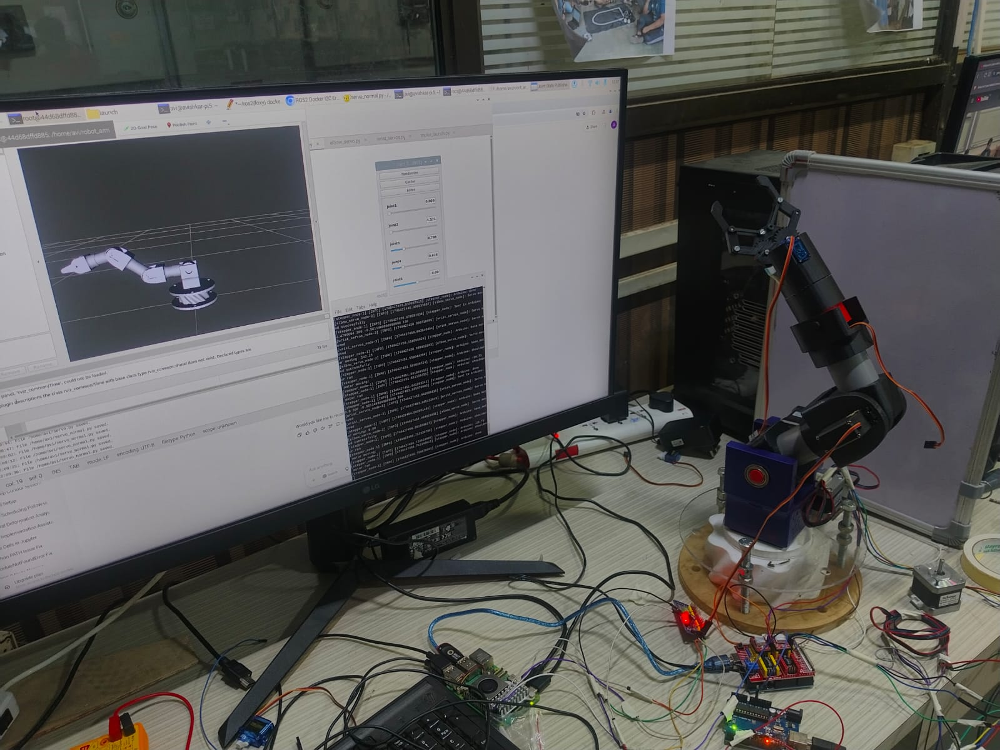

# 6-DOF Robotic Arm &#x1F916;

A robotic arm with 6 degrees of freedom made out of 3d printed parts. The software stack is majorly present in a docker container setup in RaspberryPi5 OS. Its software side consists of a ROS2 pipeline written in Python with some C++ code in the Arduino IDE for controlling the stepper motors.

## Current Functionality:

* Individual joint angles can be altered using the JointStatePublisherGui and the respective changes in the configuration can be seen in the 3d model on Rviz2
* The desired joint angles can then be passed on to the hardware by pressing the "Enter" button in the GUI
* The hardware model receives the joint angles and aligns itself to match the configuration of the 3D model visualized in RViz

## Pic of the model:



## Softwares Used:

* SolidWorks
* Docker
* RaspberryPi 5 OS
* Arduino IDE
* ROS2 Foxy
* RViz2

## Steps to replicate an identical model:

### I. CAD Model:

SolidWorks was used for creating the individual parts and assembling them together. If you want to use an identical model the cad files for all the individual parts and the assembly is present in the [Cad_files](Cad_files/) folder.

#### References used for modelling:

[RoTechnic Playlist](https://www.youtube.com/@roTechnic/playlists)

[Cycloidal Gear design](https://ewhiteowls.com/2022/02/the-ultimate-guide-to-design-cycloidal-drives-the-beating-heart-of-robotic-arms/)

### II. Setting up Raspi5 Env:

Boot the raspi5 OS into the raspi by cloning the image into an usb. The image can be cloned into an usb by using [RaspberryPi Imager](https://www.raspberrypi.com/software/).
Configure the Pi accordingly. Some key configuration steps to follow:


1. Go into Raspi-Config
2. Enable SSH, VNC, I2C
3. Enable serial hardware port
4. Change the forwarding from Wayland to X11

Clone the repo:

```bash
git clone https://github.com/Avishkar1312/6-DOF-Robotic-Arm.git
```
Go into the folder and build the docker image

```bash
docker build -t your-image-name .
```


